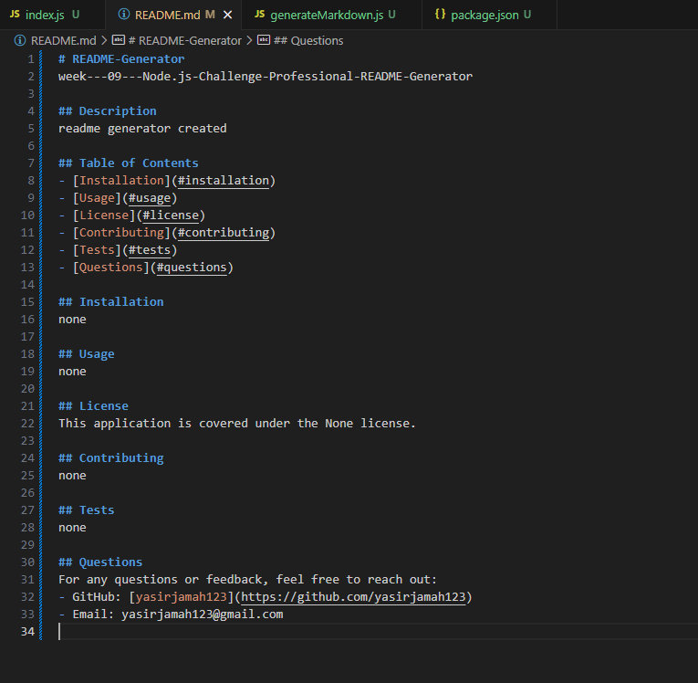

# README-Generator
week---09---Node.js-Challenge-Professional-README-Generator

## uder story
```md
AS A developer
I WANT a README generator
SO THAT I can quickly create a professional README for a new project
```

## Description
This CLI application dynamically generates a professional README.md file from user input using the Inquirer package. It prompts users with questions related to their project and compiles the responses into a high-quality README file.

## Key Features
Interactive command-line interface (CLI) for user input.
Automatically generates sections such as Description, Table of Contents, Installation, Usage, License, Contributing, Tests, and Questions.
Allows users to choose a license for their application from a predefined list.
Creates a corresponding badge for the selected license.
Includes GitHub username and email in the Questions section for contact information.

## screenshots


## video links
https://drive.google.com/file/d/16ZiZhAblim782iy-1YkWwYeFs8hT0JXo/view

## deployment link 
https://yasirjamah123.github.io/week---09---Node.js-Challenge-Professional-README-Generator/
